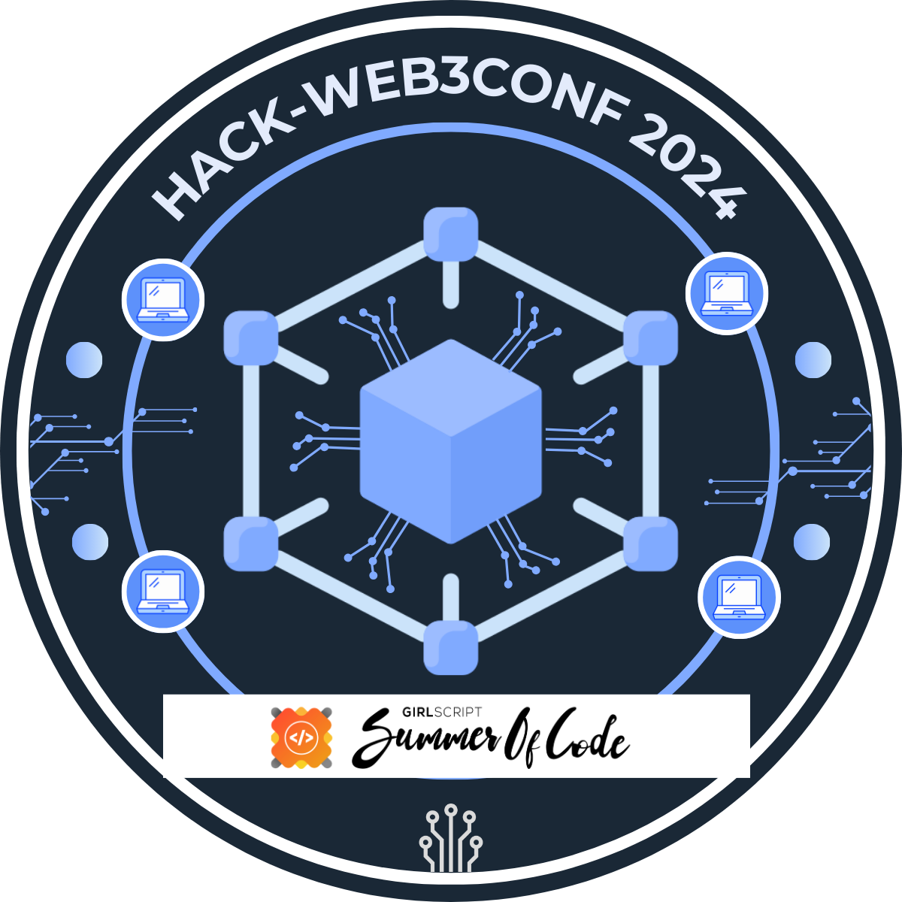
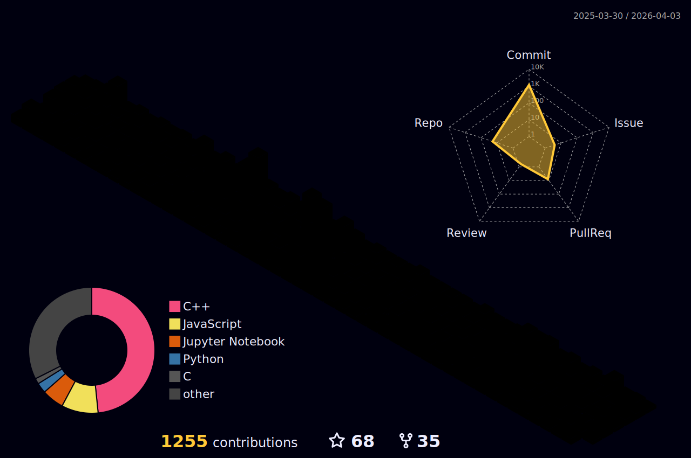
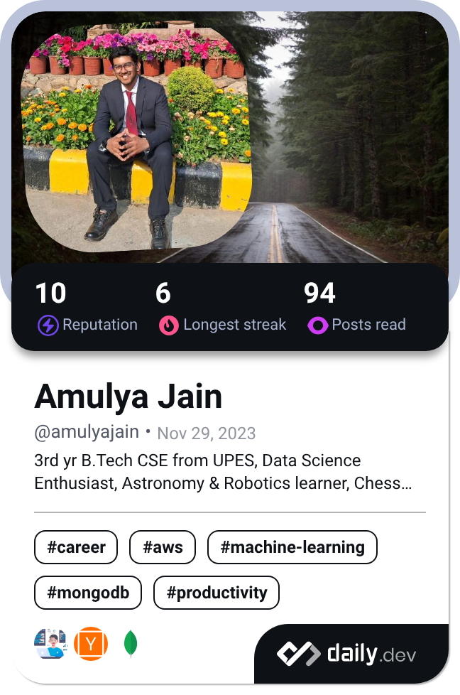

  

    
    <h1>
           
    </h1>

I'm a Machine Learning Engineer and Full-Stack Web Developer passionate about transforming innovative ideas into creative solutions, writing clean & efficient code and continuously learning.

### 🚀 About Me

- 🎓 **Pursuing:** Currently, I'm a 3rd-year undergraduate pursuing my Bachelor of Technology (B.Tech) in Computer Science Engineering (CSE) at the <a href="https://www.upes.ac.in/" target="_blank">University of Petroleum and Energy Studies (UPES)</a>, Dehradun, Uttarakhand, India.
- 👨‍💻 **Specialization:** in Artificial Intelligence and Machine Learning (AIML)
- 🌱 **Currently learning:** Statistics, Deep Learning & Data Structures and Algorithms (DSA). 
- 💼 **Working on:** Machine Learning Full Stack Project.
- 📫 **How to reach me:**  Email at: **Amulya.122439@stu.upes.ac.in, [Linked In](https://www.linkedin.com/in/amulya-jain04/)**, **[Portfolio](https://amulyajain2004.github.io/)**.
- ⚡ Fun fact: **I'm not just a code enthusiast, but I'm also a chess player🤴, an academic all-star 📚, and an astronomy freak 🔭. When I'm not coding, you'll often find me exploring the fascinating world of astronomy and astrophysics 🚀 through books and internet or sharing a laugh with friends over a game of chess ♟.**

### 🌐 Connect with Me

<table>
  <tr>
    <td align="center">
      <a href="https://www.linkedin.com/in/amulya-jain04/" target="_blank">
         
        <b>LinkedIn</b>
      </a>
    </td>
    <td align="center">
      <a href="https://kaggle.com/amulyajain2004" target="_blank">
         
        <b>Kaggle</b>
      </a>
    </td>
    <td align="center">
      <a href="https://www.instagram.com/amulyajain89/" target="_blank">
         
        <b>Instagram</b>
      </a>
    </td>
    <td align="center">
      <a href="https://hashnode.com/@alokik89" target="_blank">
         
        <b>Hashnode</b>
      </a>
    </td>
    <td align="center">
      <a href="https://www.youtube.com/channel/UCBhplGqDR5MGrGmqoV_RR2Q" target="_blank">
         
        <b>YouTube</b>
      </a>
    </td>
    <td align="center">
      <a href="https://www.codechef.com/users/alokik_engg_89" target="_blank">
         
        <b>CodeChef</b>
      </a>
    </td>
    <td align="center">
      <a href="https://www.hackerrank.com/profile/jainamulyawin" target="_blank">
         
        <b>HackerRank</b>
      </a>
    </td>
    <td align="center">
      <a href="https://www.leetcode.com/amulya_89-curious" target="_blank">
         
        <b>LeetCode</b>
      </a>
    </td>
    <td align="center">
      <a href="https://auth.geeksforgeeks.org/user/user_6jg2kzes1gw" target="_blank">
         
        <b>GFG</b>
      </a>
    </td>
    <td align="center">
      <a href="https://www.topcoder.com/members/amulya[2004]" target="_blank">
         
        <b>TopCoder</b>
      </a>
    </td>
  </tr>
</table>

### 🛠️ Tech Stack

<table border="1" cellspacing="0" cellpadding="8">
    <!-- Programming Languages -->
    <tr>
        <th>Main Category</th>
        <th>Subcategory</th>
        <th colspan="5">Technologies / Tools</th>
    </tr>
    <tr>
        <td rowspan="1"><b>Programming Languages</b></td>
        <td></td>
        <td><a href="https://www.c-language.org/" target="_blank">
C
</a></td>
        <td><a href="https://en.cppreference.com/w/cpp/language.html" target="_blank">
C++
</a></td>
        <td><a href="https://www.java.com/en/" target="_blank">
Java
</td>
        <td><a href="https://www.python.org/" target="_blank">
Python
</td>
        <td><a href="https://www.javascript.com/" target="_blank">
JavaScript
</td>
    </tr>
    <tr>
        <td rowspan="1"><b>Scripting</b></td>
        <td></td>
        <td><a href="https://www.gnu.org/software/bash/" target="_blank">
Bash
</a></td>
    </tr>
    <!-- Web Development -->
    <tr>
        <td rowspan="4"><b>Web Development</b></td>
        <td>Core</td>
        <td>
HTML
</td>
        <td>
CSS
</td>
        <td>
Markdown
</td>
        <td>
JSON
</td>
    </tr>
    <tr>
        <td>Styling Frameworks</td>
        <td>
Tailwind
</td>
        <td>
Bootstrap
</td>
    </tr>
    <tr>
        <td>JavaScript Libraries, Frameworks & Environment</td>
        <td>
React.js
</td>
        <td>
Node.js
</td>
        <td>
Express.js
</td>
    </tr>
    <tr>
        <td>Python Frameworks</td>
        <td>
Django
</td>
        <td>
Django REST Framework
</td>
        <td>
FastAPI
</td>
    </tr>
    <!-- Databases -->
    <tr>
        <td rowspan="2"><b>Databases</b></td>
        <td>Relational Databases</td>
        <td>
SQLite
</td>
        <td>
MySQL
</td>
        <td>
PostgreSQL
</td>
    </tr>
    <tr>
        <td>Non-Relational Databases</td>
        <td>
MongoDB
</td>
    </tr>
    <!-- <tr>
        <td>Vector Databases</td>
        <td>
Vector Databases
</td>
    </tr> -->
    <!-- Data Science -->
    <tr>
        <td rowspan="5"><b>Data Science / AIML</b></td>
        <td>Development Environment</td>
        <td>
Jupyter
</td>
        <td> 
Anaconda
</td>
    </tr>
    <tr>
        <td>Data Visualisation Tools</td>
        <!-- <td>Power BI</td> -->
        <td>
Plotly
</td>
        <!-- <td>Dash</td> -->
        <td>
Matplotlib
</td>
        <!-- <td>
Seaborn
</td> -->
    </tr>
    <tr>
        <td>Scientific Computing and Other Libraries</td>
        <td>
NumPy
</td>
        <td>
Pandas
</td>
        <!-- <td>SciPy</td> -->
    </tr>
    <!-- <tr>
        <td>NLP</td>
        <td>NLTK</td>
        <td>spaCy</td>
    </tr> -->
    <tr>
        <td>Machine Learning</td>
        <td>
Scikit-learn
</td>
    </tr>
    <tr>
        <td>Deep Learning</td>
        <td>
PyTorch
</td>
        <!-- <td>
TensorFlowjs
</td>
        <td></td> -->
    </tr>
    <!-- DevOps / MLOps -->
    <!-- <tr>
        <td><b>DevOps / MLOps</b></td>
        <td></td>
        <td>
Docker
</td>
        <td>MLflow</td>
    </tr> -->
    <!-- Deployment -->
    <tr>
        <td><b>Deployment</b></td>
        <td></td>
        <td>
Vercel
</td>
        <td>
Netlify
</td>
        <td>
GitHub Actions
</td>
        <td>
Render
</td>
    </tr>
    <!-- Version Control -->
    <tr>
        <td><b>Version Control</b></td>
        <td></td>
        <td>
Git
</td>
        <td>
GitHub
</td>
    </tr>
    <!-- API Testing -->
    <tr>
        <td><b>API Testing</b></td>
        <td></td>
        <td>
Postman
</td>
    </tr>
</table>

### 🏆 Highlights
  <!-- I have to write about by OS contributions forks and other future projects and uncomment as I complete the incomplete -->
- 🏅 **Top Repositories:**  

  #### Projects

  - [CtrlX Error](https://github.com/AmulyaJain2004/CtrlX_Error) - *Collaborative Bug Tracking System for Software Teams using MERN stack & Deployed*  
  - [Notes-app](https://github.com/AmulyaJain2004/Notes-app) - *Full Stack Note Taking App using Django, Django REST Framework & ReactJS*
  - [AttendanceTracker](https://github.com/AmulyaJain2004/AttendanceTracker) - *Attendance Tracker for maintaining record of missed classes for minimum percentage criteria in University using Django, HTML, CSS & JS*
  - [Tic-Tac-Toe-Game](https://github.com/AmulyaJain2004/Tic-Tac-Toe-Game) - *Min-Max Algorithm based TicTacToe with Python GUI and Matplotlib Visualisation*
  - [HousePricePrediction](https://github.com/AmulyaJain2004/HousePricePrediction) - *Machine Learning Project Predicting House Prices using Linear Regression*
  - [TaskManagementSystem](https://github.com/AmulyaJain2004/TaskManagementSystem) - *Full Stack Task Alloting and Management application MERN stack & Deployed*
  - [Amulya-UPES-website](https://github.com/AmulyaJain2004/Amulya-UPES-website) - *Redesign of Homepage of UPES website*
  <!-- - [AmulyaJain2004.github.io](https://github.com/AmulyaJain2004/AmulyaJain2004.github.io) - *My Portfolio Website* -->

  #### Open Source Contributions

  - [UPES_Courses_through_Notes_and_Codes](https://github.com/AmulyaJain2004/UPES_Courses_through_Notes_and_Codes) - *Repository for all the resources, labs, and assignments for the programming courses offered at the University of Petroleum and Energy Studies (UPES).*
  - Others to be added soon for now check out my Contribution Activity :)

  #### Programming Languages and Frameworks Learnings

  - [PyInsightHub](https://github.com/AmulyaJain2004/PyInsightHub) - *Repository of Cool Python Programming*
  - [CUniverse-Exploring-C-Cosmos](https://github.com/AmulyaJain2004/CUniverse-Exploring-C-Cosmos) - *Repository of Cool C Programming*
  - [InfinityShellWizards-Journey-to-Bash-Shell-Scripting](https://github.com/AmulyaJain2004/InfinityShellWizards-Journey-to-Bash-Shell-Scripting) - *Linux Bash Shell Scripting repository to learn and explore*
  - [JavaUltimateUnite](https://github.com/AmulyaJain2004/JavaUltimateUnite) - *Repository of Cool Java Programming*
  <!-- - [CppCodeCrafters-Lets-Innovate](https://github.com/AmulyaJain2004/CppCodeCrafters-Lets-Innovate) - *Repository of Cool Cpp Programming*
  - [LetsGo](https://github.com/AmulyaJain2004/LetsGo) - *Repository of Cool Go Programming*
  - [Learning-useR](https://github.com/AmulyaJain2004/Learning-useR) - *Repository of Cool R Programming*
  - [SQLyticsSphere](https://github.com/AmulyaJain2004/SQLyticsSphere) - *Repository of Cool SQL, NoSQL Databases* -->
  <!-- - [Advanced-Python](https://github.com/AmulyaJain2004/Advanced-Python) - *Repository of Cool Django Framework Learning* -->

  #### Problem Solving

  - [The_Art_of_Leetcoding](https://github.com/AmulyaJain2004/The_Art_of_Leetcoding) - *Repository collection of my LeetCode Problem Solving*
  - [GeeksforGeeksDSA](https://github.com/AmulyaJain2004/GeeksforGeeksDSA) - *Repository collection of my GeeksForGeeks Problem Solving*

- 🌟 **Achievements:**  
  - Open Source Achievement: GSSOC(24) Extd Badges 🪶
    <table>
        <tr>
            <td style="border-right: 1px solid #dddddd; padding: 15px;" valign="top" width="50%">
                <a href="https://gssoc.girlscript.tech/leaderboard">
                
                 
                <strong>GirlScript Summer of Code 2024 Extended</strong>
                </a>
             
             
                🏅 Ranked 355th
             
                
                Out of 32000+ participants 
                PRs Merged: 3  
                Total Badges: 7 
                Total Score: 1025 
                
            </td>
            <td>
                

                <a href="https://gssoc.girlscript.tech/leaderboard">
                    
                    
                    
                    
                    
                    
                    
                </a>
                

            </td>
        </tr>
    </table>
  - Open Source Badges
    
    

   
  

  <!--
  - [Credly Skills and Badges Wallet](https://www.credly.com/users/amulya-jain.6f99407b) 
  - IBM Professional DataSceince Skill Badges
  - Linkedin uploaded certificates
  - Google Cloud Skill Badges
  - Coding Platform Portfolios Codolio
  - LeetCode, Hackerrank, Deep-ml
  -->
    <!-- 

    
    
    
    
    
-->

### 📈 My GitHub Stats: -

 

<table>
    <tr>
        
  

    </tr>
    <tr>
        <td>
            
        </td>
        <td>
            
        </td>
    </tr>
</table>

<!---->

 

