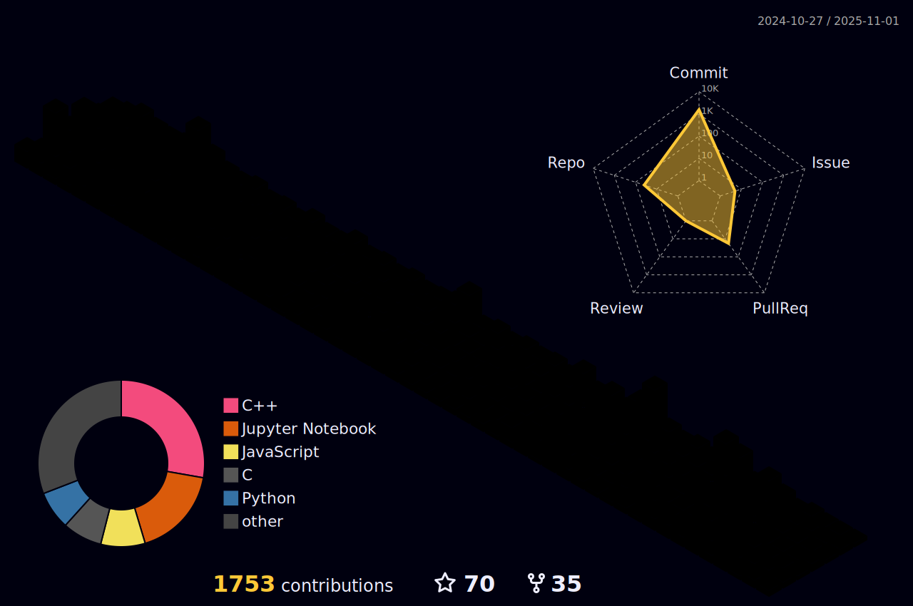
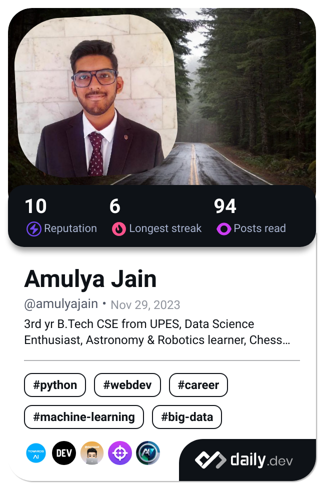

  

    
    <h1>
           
    </h1>

I'm a Machine Learning Engineer and Full-Stack Web Developer passionate about transforming innovative ideas into creative solutions, writing clean & efficient code and continuously learning.
I'm AI Developer intern at TechnoAce Consultancy Services Private Limited Startup.

### 🚀 About Me
- 🎓 **Pursuing :** 🎓 Currently, I'm a 2nd-year undergraduate pursuing my Bachelor of Technology (B.Tech) in Computer Science Engineering (CSE) t the University of Petroleum and Energy Studies (UPES), Dehradun, Uttarakhand, India.
- 👨‍💻 **Specialization:** in Artificial Intelligence and Machine Learning (AIML)
- 🌱 **Currently learning:** Statistics, Deep Learning & Data Structures and Algorithms (DSA). 
- 💼 **Working on:** AI integrations at Internship.
- 📫 **How to reach me:**  Email at: **Amulya.122439@stu.upes.ac.in**.
- ⚡ Fun fact: **I'm not just a code enthusiast, but I'm also a chess player🤴, an academic all-star 📚, and an astronomy freak 🔭. When I'm not coding, you'll often find me exploring the fascinating world of astronomy and astrophysics 🚀 through books and internet or sharing a laugh with friends over a game of chess ♟.**

### 🛠️ Tech Stack

<link rel="stylesheet" type='text/css' href="https://cdn.jsdelivr.net/gh/devicons/devicon@latest/devicon.min.css" />
          
<table border="1" cellspacing="0" cellpadding="8">
    <!-- Programming Languages -->
    <tr>
        <th>Main Category</th>
        <th>Subcategory</th>
        <th colspan="5">Technologies / Tools</th>
    </tr>
    <tr>
        <td rowspan="1"><b>Programming Languages</b></td>
        <td></td>
        <td>
C
</td>
        <td>
C++
</td>
        <td>
Java
</td>
        <td>
Python
</td>
        <td>
JavaScript
</td>
    </tr>
    <tr>
        <td rowspan="1"><b>Scripting</b></td>
        <td></td>
        <td>
Bash
</td>
    </tr>
    <!-- Web Development -->
    <tr>
        <td rowspan="4"><b>Web Development</b></td>
        <td>Core</td>
        <td>
HTML
</td>
        <td>
CSS
</td>
        <td>
Markdown
</td>
        <td>
JSON
</td>
    </tr>
    <tr>
        <td>Styling Frameworks</td>
        <td>
Tailwind
</td>
        <td>
Bootstrap
</td>
    </tr>
    <tr>
        <td>JavaScript Library, Frameworks and Environment</td>
        <td>
React.js
</td>
        <td>
Node.js
</td>
        <td>
Express.js
</td>
        <td>
Node Package Manager
</td>
    </tr>
    <tr>
        <td>Python Frameworks</td>
        <td>
Django
</td>
        <td><i class="devicon-djangorest-plain" style="font-size:55px"></i>
DRF
</td>
        <td>
FastAPI
</td>
    </tr>
    <!-- Databases -->
    <tr>
        <td rowspan="2"><b>Databases</b></td>
        <td>Relational Databases</td>
        <td>
SQLite
</td>
        <td>
MySQL
</td>
        <td>
PostgreSQL
</td>
    </tr>
    <tr>
        <td>Non-Relational Databases</td>
        <td>
MongoDB
</td>
    </tr>
    <!-- Data Science -->
    <tr>
        <td rowspan="5"><b>Data Science / ML / AI</b></td>
        <td>Development Environment</td>
        <td>
Jupyter
</td>
        <td> 
Anaconda
</td>
    </tr>
    <tr>
        <td>Data Visualisation Tools</td>
        <!-- <td>Power BI</td> -->
        <!-- <td>
Plotly
</td> -->
        <!-- <td>Dash</td> -->
        <td>
Matplotlib
</td>
        <!-- <td>
Seaborn
</td> -->
    </tr>
    <tr>
        <td>Scientific Computing and other</td>
        <td><i class="devicon-numpy-plain-wordmark" style="font-size: 60px"></i>
NumPy
</td>
        <!-- <td>SciPy</td> -->
        <td>
        <i class="devicon-pandas-plain-wordmark" style="font-size:50px" ></i>
Pandas
</td>
    </tr>
    <!-- <tr>
        <td>NLP</td>
        <td>NLTK</td>
        <td>spaCy</td><td></td><td></td>
    </tr> -->
    <tr>
        <td>Machine Learning</td>
        <td>
Scikit-learn
</td>
    </tr>
    <tr>
        <td>Deep Learning</td>
        <td>
PyTorch
</td>
        <!-- <td>
TensorFlowjs
</td>
        <td></td> -->
    </tr>
    <!-- DevOps / MLOps -->
    <!-- <tr>
        <td><b>DevOps / MLOps</b></td>
        <td>-</td>
        <td>
Docker
</td>
        <td>MLflow</td><td></td><td></td>
    </tr> -->
    <!-- Deployment -->
    <tr>
        <td><b>Deployment</b></td>
        <td></td>
        <td>
Vercel
</td>
        <td>
Netlify
</td>
    </tr>
    <!-- Version Control -->
    <tr>
        <td><b>Version Control</b></td>
        <td></td>
        <td>
Git
</td>
        <td>
GitHub
</td>
    </tr>
    <!-- API Testing -->
    <tr>
        <td><b>API Testing</b></td>
        <td></td>
        <td>
Postman
</td>
    </tr>
</table>

### 🏆 Highlights
<!-- - 🏅 **Top Repositories:**  
  - [Repo Name 1](https://github.com/YourUsername/Repo1) - *Short description*  
  - [Repo Name 2](https://github.com/YourUsername/Repo2) - *Short description*   -->

- 🌟 **Achievements:**  
  - Open Source Achievement: GSSOC(24) Extd Badges 🪶
    <table>
        <tr>
            <td style="border-right: 1px solid #dddddd; padding: 15px;" valign="top" width="50%">
                <a href="https://gssoc.girlscript.tech/leaderboard">
                
                 
                <strong>GirlScript Summer of Code Extend</strong>
                </a>
             
             
                🅠Ranked 355th
             
                
                Out of 32000+ participants 
                PRs Merged: 3  
                Total Badges: 7 
                Total Score: 1025 
                
            </td>
            <td>
                

                <a href="https://gssoc.girlscript.tech/leaderboard">
                    
                    
                    
                    
                    
                    
                    
                </a>
                

            </td>
        </tr>
    </table>
  - IBM Professional DataSceince Skill Badges
  - Google Cloud Skill Badges
  - Coding Platform Portfolios
  - LeetCode
    <!-- 

    
    
    
    
    
-->
    <!-- 

      
    
  -->

### 🌐 Connect with Me

<table>
  <tr>
    <td align="center">
      <a href="https://www.linkedin.com/in/amulya-jain04/" target="_blank">
         
        <b>LinkedIn</b>
      </a>
    </td>
    <td align="center">
      <a href="https://kaggle.com/amulyajain@2004" target="_blank">
         
        <b>Kaggle</b>
      </a>
    </td>
    <td align="center">
      <a href="https://www.instagram.com/amulyajain89/" target="_blank">
         
        <b>Instagram</b>
      </a>
    </td>
    <td align="center">
      <a href="https://hashnode.com/@alokik89" target="_blank">
         
        <b>Hashnode</b>
      </a>
    </td>
    <td align="center">
      <a href="https://www.youtube.com/channel/UCBhplGqDR5MGrGmqoV_RR2Q" target="_blank">
         
        <b>YouTube</b>
      </a>
    </td>
    <td align="center">
      <a href="https://www.codechef.com/users/alokik_engg_89" target="_blank">
         
        <b>CodeChef</b>
      </a>
    </td>
    <td align="center">
      <a href="https://www.hackerrank.com/profile/jainamulyawin" target="_blank">
         
        <b>HackerRank</b>
      </a>
    </td>
    <td align="center">
      <a href="https://www.leetcode.com/amulya_89-curious" target="_blank">
         
        <b>LeetCode</b>
      </a>
    </td>
    <td align="center">
      <a href="https://auth.geeksforgeeks.org/user/user_6jg2kzes1gw" target="_blank">
         
        <b>GFG</b>
      </a>
    </td>
    <td align="center">
      <a href="https://www.topcoder.com/members/amulya[2004]" target="_blank">
         
        <b>TopCoder</b>
      </a>
    </td>
  </tr>
</table>

### 📈 My GitHub Stats: -

 

<table>
    <tr>
        
  

    </tr>
    <tr>
        <td>
            
        </td>
        <td>
            
        </td>
    </tr>
</table>

 

